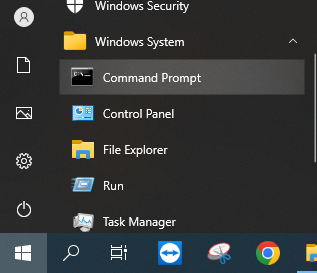
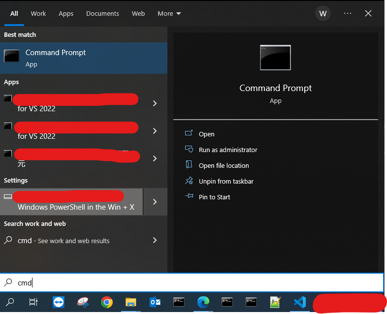
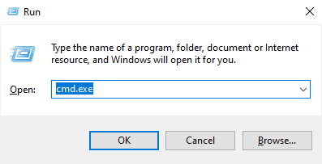

# ✨ Introduction 介紹

## Intro
Command Prompt ( 別名：Command Line，以下簡稱 : [[cmd]] ) 中文名稱為**命令行界面**，該界面是 Windows系統與人交互的最簡潔界面，早期電腦系統沒有[[UI|圖形界面 ( UI )]]時，要想與電腦交互則必須透過 cmd 來輸入指令以獲取想要的資訊。例如：現在我們只需要點擊圖標打開**此電腦**，再次選擇選擇對應圖標的槽便可瀏覽文件資料；在沒有圖形界面的情況下，我們可以使用 cmd，以輸入路徑的形式開啓指定槽并且瀏覽。 

### 系統 CMD 與 程式 Console 的區別
通常情況下，初學者學習編寫程式碼時，并不會考慮[[UI|圖形界面 ( UI )]]，因此執行時會立刻跳出類似 cmd 的界面，而該界面則會顯示程式碼執行的結果，亦或是要求輸入某些參數，這便是程式與人的交互最簡潔、最直接的交互。 

電腦系統只是一個相對龐大的程式，因此 cmd 是我們與系統溝通的工具；而我們用各種程式語言寫的程式所跳出來的黑色框框，則是我們與自己的程式進行溝通的界面，通常稱作 Console，但其本質上也是 cmd，名稱差異只是方便區分罷了。這便是 cmd 的作用，用於與程式交互、溝通。 

### 額外
[[UI|圖形界面 ( UI )]]取代了繁瑣的指令輸入，透過滑鼠、觸控等輸入設備來操作程式，其背後原理僅僅是重新定義了指令的輸入方式，諸如點擊、雙擊、滑動、拖拽等操作事件，背後依舊是在執行各種 cmd 指令，這樣便大幅度降低了學習成本。

### 總結
無論你使用 cmd 的目的爲何，若是作爲程式初學者，確實可以不用關心 cmd 是什麽，只要明白它能夠輸入輸出即可；若希望更加精進自己的程式能力，就必須學會與程式本身進行溝通，要知道[UI|圖形界面 ( UI )]]對於程式設計師來説只是副產品，界面留給用戶與程式打交道，我們作爲程式開發者，理應掌握更直接與程式溝通的方式————命令行界面。

# 🌟 Starting 開啓

## A. 開始菜單中開啓 CMD
Windows 系統界面，預設在左下角有一個田字圖案，點擊以開啓菜單 [](Logo) ( 快捷鍵：Win鍵 ) 
下滑找到 **Windows系統**資料夾，點擊展開後，執行**命令行**界面 
如下圖所示： 
<br><br>
<br><br>

## B. 搜尋方式中開啓 CMD
Windows 系統界面，預設在左下角有一個放大鏡圖案，點擊以開啓搜尋 [](Logo) 
在搜尋欄輸入 "cmd"，通常情況下第一個便是 **命令行**界面 
如下圖所示： 
<br><br>
<br><br>

## C. 以啓動指令開啓 CMD
Windows 系統界面，在任何情況下點擊：( Win鍵 + R鍵 ) 會自動彈出啓動界面，在輸入欄中輸入要執行的程式名稱，點擊 OK 則會立刻執行。此處輸出 cmd 再點擊 OK 即可開啓。
<br><br>
<br><br>


# 📔 指令集

- 指令説明：
    ``` cmd
        cd      // 在同一個槽中切換路徑 >> D:\Data_A 切換到 D:\File_B
        cd /d   // 切換路徑及盤符 ( 槽 ) >> D:\File 切換到 C:\File

        其中 /d 為 cd 的參數 ( 即：Driver ) 意為連同盤符 ( 槽 ) 一并切換

        ls      // 清單 ( List 的縮寫 )，意為顯示當前文件夾下的清單
        ls -ls  // 清單以清單形式顯示，前者為顯示所有資料清單，後者則是以清單格式顯示的意思
    ```

### 切換盤符 ( 即：切換槽 )

- 切換盤符的範例 >> **在 cmd 中輸入**
    ``` cmd
        "cd /d C:\"                 // 切換至 C 槽
        "cd /d D:\"                 // 切換至 D 槽
        "cd /d D:\Data\File"        // 切換至 路徑： D:\Data\File
    ```

- Tips：如果路徑最末端非文件夾，而是某種格式的檔案或軟體，則會被立刻開啓
    ``` cmd
        "cd /d D:\Data\Logo.jpg"    // 打開圖片： Logo.jpg
    ```

- 顯示該路徑下的文件範例 >> **在 cmd 中輸入**
    ``` cmd
        "ls"            // 顯示所有路徑下文件
        "ls -ls"        // 小技巧：讓文件輸出方式更直觀
    ```

// TODO: ### 清空界面 Clear<br>
// TODO: ### 變數宣告 SET<br>
// TODO: ### 呼叫變數 %名稱%<br>
// TODO: ### 脚本程式碼 Batch檔<br>
// MORE<br>

To Be Continue...
